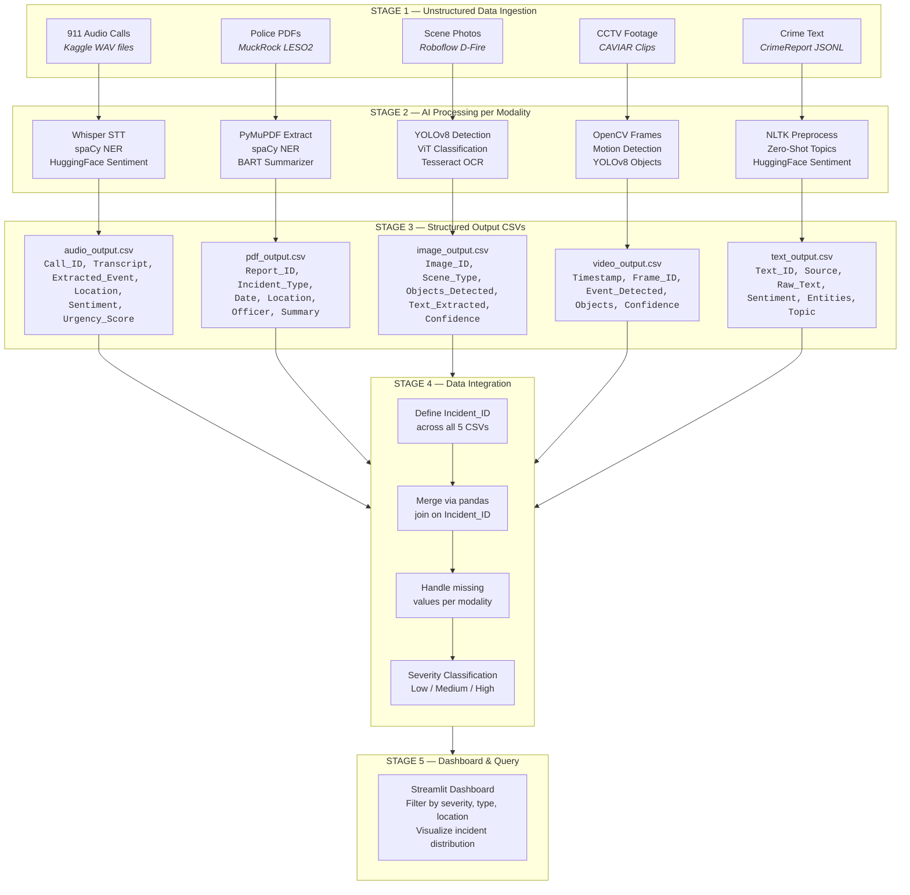
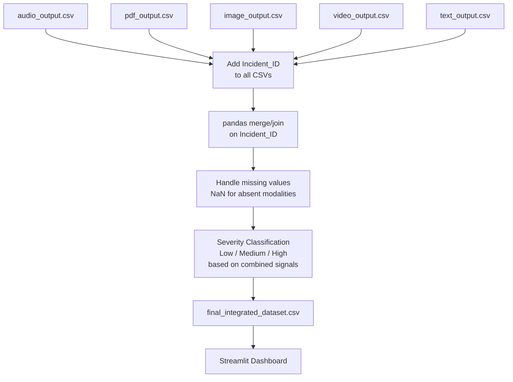
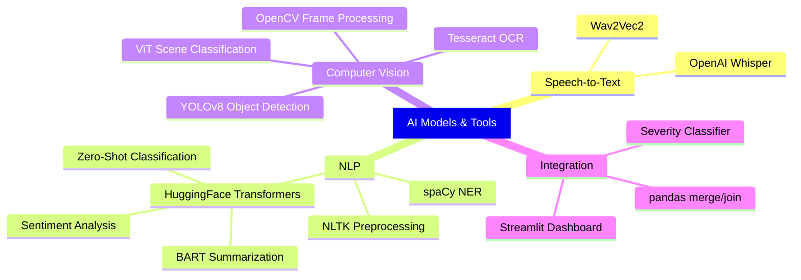

# AI Pipeline Architecture — Multimodal Crime / Incident Report Analyzer

> **Course:** AI for Engineers | **Team Size:** 5 | **Due:** March 31, 2026 | **Total Marks:** 100

---

## High-Level System Architecture



---

## Team Roles & Pipeline Ownership

| Student | Role | Data Type | Key AI Tools | Output CSV |
|---------|------|-----------|-------------|------------|
| **Lokeshwar** (Student 1) | Audio Analyst | 911 emergency calls | Whisper, spaCy, HuggingFace | `audio_output.csv` |
| **Neha** (Student 2) | Document Analyst | Police report PDFs | PyMuPDF, spaCy NER, BART | `pdf_output.csv` |
| **Nagraj** (Student 3) | Image Analyst | Fire/scene photos | YOLOv8, ViT, Tesseract | `image_output.csv` |
| **Rahul** (Student 4) | Video Analyst | CCTV surveillance | OpenCV, YOLOv8, motion det. | `video_output.csv` |
| **Swet** (Student 5) | Text Analyst | Crime reports/news | NLTK, spaCy, HuggingFace | `text_output.csv` |

---

## Detailed Pipeline Flow Diagram

```mermaid
flowchart LR
    subgraph S1["Student 1 — Lokeshwar"]
        direction TB
        A_IN["WAV Audio Files"]
        A_W["Whisper STT"]
        A_NER["spaCy NER<br/>Events, Locations"]
        A_SENT["HuggingFace<br/>Sentiment + Urgency"]
        A_OUT["audio_output.csv"]
        A_IN --> A_W --> A_NER --> A_SENT --> A_OUT
    end

    subgraph S2["Student 2 — Neha"]
        direction TB
        B_IN["PDF Documents"]
        B_EXT["PyMuPDF / pdfplumber<br/>+ Tesseract OCR"]
        B_NER["spaCy NER<br/>Dates, Names, Locations"]
        B_SUM["BART Summarizer"]
        B_OUT["pdf_output.csv"]
        B_IN --> B_EXT --> B_NER --> B_SUM --> B_OUT
    end

    subgraph S3["Student 3 — Nagraj"]
        direction TB
        C_IN["Scene Images"]
        C_YOLO["YOLOv8<br/>Object Detection"]
        C_VIT["ViT Scene<br/>Classification"]
        C_OCR["Tesseract OCR<br/>Text in Images"]
        C_OUT["image_output.csv"]
        C_IN --> C_YOLO --> C_VIT --> C_OCR --> C_OUT
    end

    subgraph S4["Student 4 — Rahul"]
        direction TB
        D_IN["CCTV Video Clips"]
        D_FRM["OpenCV<br/>Frame Extraction"]
        D_MOT["Motion Detection<br/>Key Frame Selection"]
        D_DET["YOLOv8<br/>Object Detection"]
        D_EVT["Rule-Based<br/>Event Classification"]
        D_OUT["video_output.csv"]
        D_IN --> D_FRM --> D_MOT --> D_DET --> D_EVT --> D_OUT
    end

    subgraph S5["Student 5 — Swet"]
        direction TB
        E_IN["Crime Text / News"]
        E_PRE["NLTK Preprocess<br/>Tokenize, Clean"]
        E_NER["spaCy NER<br/>Entities"]
        E_TOP["Zero-Shot<br/>Topic Classification"]
        E_SENT["HuggingFace<br/>Sentiment Analysis"]
        E_OUT["text_output.csv"]
        E_IN --> E_PRE --> E_NER --> E_TOP --> E_SENT --> E_OUT
    end
```



---

## Integration Phase (Stage 4) — Final Merged Dataset



### Final Integrated Output Schema

| Column | Source | Description |
|--------|--------|-------------|
| `Incident_ID` | Generated | Common key `INC_001, INC_002...` |
| `Audio_Event` | Audio CSV | Extracted event from 911 call |
| `PDF_Doc_Type` | PDF CSV | Incident type from police report |
| `Image_Objects` | Image CSV | Detected objects with confidence |
| `Video_Event` | Video CSV | Event detected in CCTV frame |
| `Text_Crime_Type` | Text CSV | Crime type from news/social media |
| `Severity` | Computed | Low / Medium / High from combined signals |

---

## Repository Structure

```
multimodal-incident-analyzer/
├── audio/                    # Student 1 — Lokeshwar
│   ├── audio_pipeline.py
│   ├── data/                 # 911 audio WAV files
│   ├── audio_output.csv
│   └── requirements.txt
├── pdf/                      # Student 2 — Neha
│   ├── pdf_pipeline.py
│   ├── data/                 # MuckRock LESO2.pdf
│   ├── pdf_output.csv
│   └── requirements.txt
├── images/                   # Student 3 — Nagraj
│   ├── image_pipeline.py
│   ├── data/                 # D-Fire / Roboflow images
│   ├── image_output.csv
│   └── requirements.txt
├── video/                    # Student 4 — Rahul
│   ├── video_pipeline.py
│   ├── data/CAVIAR/          # CAVIAR CCTV clips
│   ├── video_output.csv
│   └── requirements.txt
├── text/                     # Student 5 — Swet
│   ├── text_pipeline.py
│   ├── data/                 # CrimeReport dataset
│   ├── text_output.csv
│   └── requirements.txt
├── integration/              # Team — Final merge
│   ├── integrate.py
│   ├── dashboard.py          # Streamlit dashboard
│   └── final_integrated_dataset.csv
├── README.md
└── requirements.txt          # Master dependencies
```

---

## Datasets Summary

| Pipeline | Dataset | Source | Size |
|----------|---------|-------|------|
| Audio | 911 Calls + Wav2Vec2 | Kaggle | 12 audio samples |
| PDF | Arkansas PD 1033 Training Proposals | MuckRock FOIA | 75 pages, 5 reports |
| Image | D-Fire / Roboflow Fire Detection | Kaggle / Roboflow | 21,527 images |
| Video | CAVIAR CCTV Dataset | Univ. of Edinburgh | 10 clips, ~92 MB |
| Text | CrimeReport | Kaggle | 1,000+ articles |

---

## AI Models & Tools Used



---

## Marking Rubric Alignment

| Criteria | Weight | How We Address It |
|----------|--------|-------------------|
| **Problem Understanding** | 10% | Clear role assignment per student, well-defined data sources |
| **Data Collection** | 15% | Real datasets: Kaggle 911, MuckRock PDF, Roboflow fire, CAVIAR CCTV, CrimeReport |
| **AI Model Implementation** | 25% | Whisper, YOLOv8, ViT, spaCy, HuggingFace transformers across all modalities |
| **Pipeline Design** | 15% | 5-stage architecture: Ingestion → Processing → Extraction → Integration → Dashboard |
| **Data Integration** | 15% | All 5 CSVs merged on Incident_ID with severity classification |
| **Code Quality** | 10% | Organized GitHub repo with /audio, /pdf, /images, /video, /text, /integration |
| **Final Demonstration** | 10% | End-to-end demo: raw data → structured output → dashboard visualization |
